

# ☕ Cafe Sys

### Local-first Windows café operations with POS, kitchen coordination, dining workflows, inventory, customers, and recovery-aware persistence

**Flutter** · **Dart** · **Shelf** · **Drift / SQLite** · **REST** · **WebSockets** · **Windows Desktop**

> **Development Implementation · UI Integration & Release Hardening In Progress**

---

> [!IMPORTANT]
> **Visuals Notice**  
> The product visuals in this repository are **AI-assisted UI concepts created for this case study**. They are **not actual screenshots of the current application** and must not be used as evidence that every depicted control, integration, or workflow is already wired end to end.
>
> The concepts are grounded in implemented repository capabilities such as POS ordering, menu customization, tables/reservations, course hold/fire, KDS, inventory, customer/delivery data, payment records, receipts, and loyalty foundations. Where current integration is incomplete, that limitation is called out explicitly below.

> [!NOTE]
> **Private Source**  
> The implementation is commercial/private. This public repository contains only sanitized explanations, concept visuals, architecture diagrams, and evidence-backed engineering notes.

---

## Overview

Cafe Sys is a **Windows-first café operations system** with two workstation applications:

- a **Flutter POS / cashier application**
- a **Flutter KDS / kitchen display application**

Both communicate with an **authoritative local Dart/Shelf service** backed by **Drift / SQLite**.

The engineering challenge is keeping multiple operational domains consistent at the same time:

- configured menu prices and order snapshots
- dine-in / takeaway / delivery context
- tables, reservations, checks, and transfers
- held and fired preparation state
- kitchen tickets and station views
- recipe-driven ingredient depletion
- payment / receipt records
- customer, address, delivery, and loyalty data
- restart / reconnect behavior on a local venue network

The project is intentionally **local-first**: core operations do not require a cloud business backend, but clients still depend on the local host/server.

---

# Product Tour

## 01 — POS Catalog & Cart

> **Concept visual — not an actual screenshot**

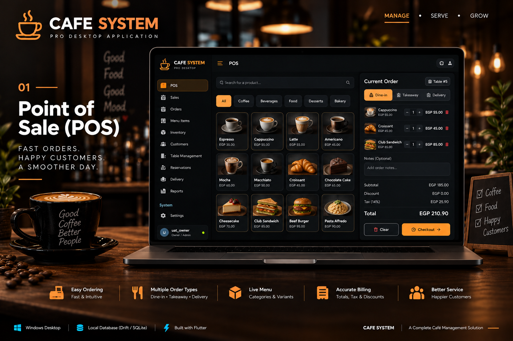

The intended cashier experience centers on fast menu discovery, order-type context, a visible cart, pricing, totals, and checkout.

---

## 02 — Product Customization

> **Concept visual — not an actual screenshot**

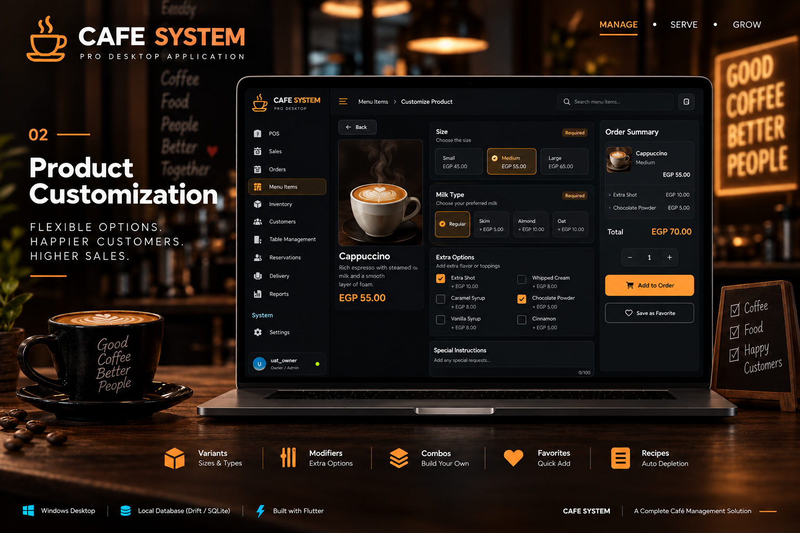

Menu modeling supports variants, modifiers, and combos. Historical order lines preserve selected commercial values instead of depending entirely on mutable live menu state.

---

## 03 — Floor Plan & Tables

> **Concept visual — not an actual screenshot**

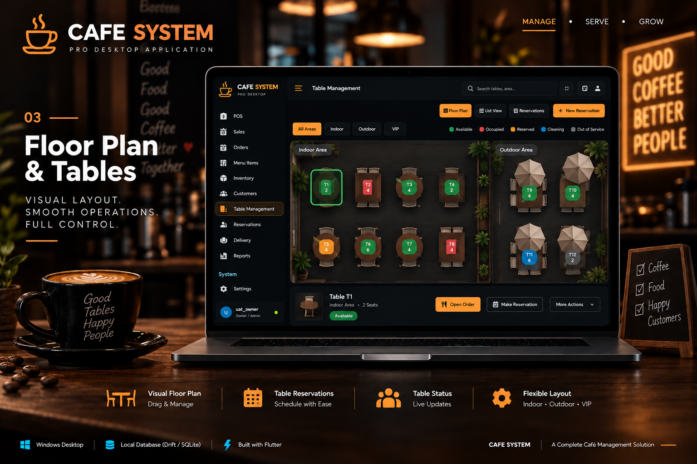

Dining workflows include table state, multiple checks, reservations, and table/check operations.

---

## 04 — Reservations & Table Operations

> **Concept visual — not an actual screenshot**

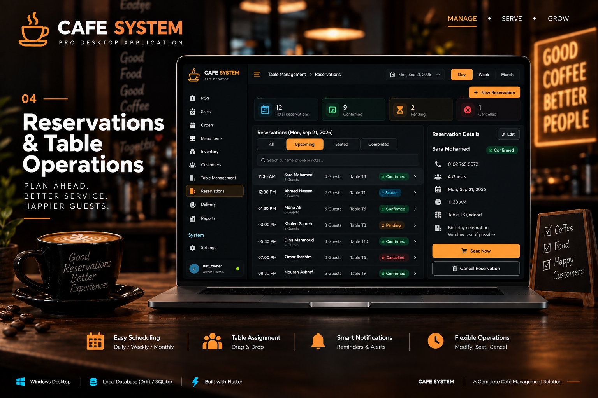

The implemented domain includes reservation rules and table-related workflows. This concept presents them as one operator surface.

---

## 05 — Kitchen Display System

> **Concept visual — not an actual screenshot**

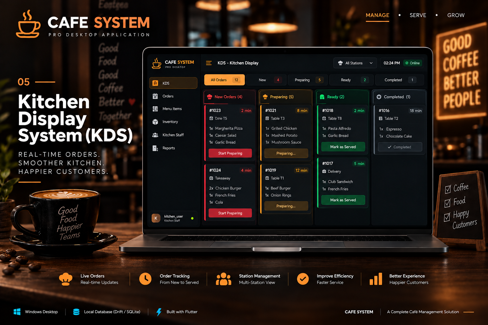

The KDS is a separate Flutter Windows workstation application. It is designed around ticket state, station filtering, elapsed time, and kitchen status advancement.

---

## 06 — Inventory Management

> **Concept visual — not an actual screenshot**

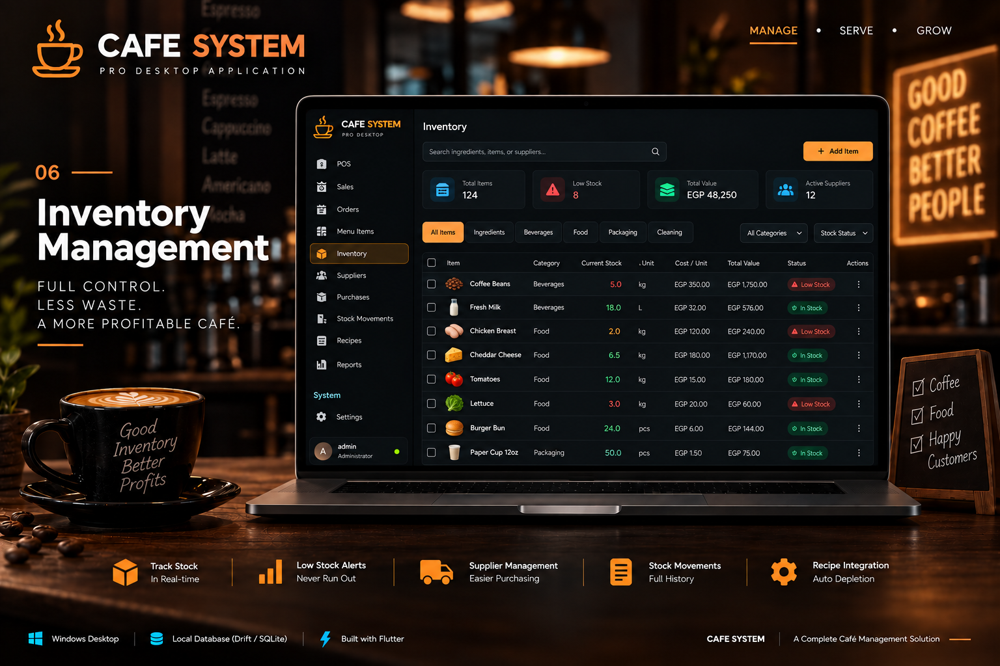

Inventory work includes ingredients, purchasing/receiving foundations, stock movements, stocktake, valuation, and recipe-driven consumption.

---

## 07 — Customers, Delivery & Loyalty

> **Concept visual — not an actual screenshot**

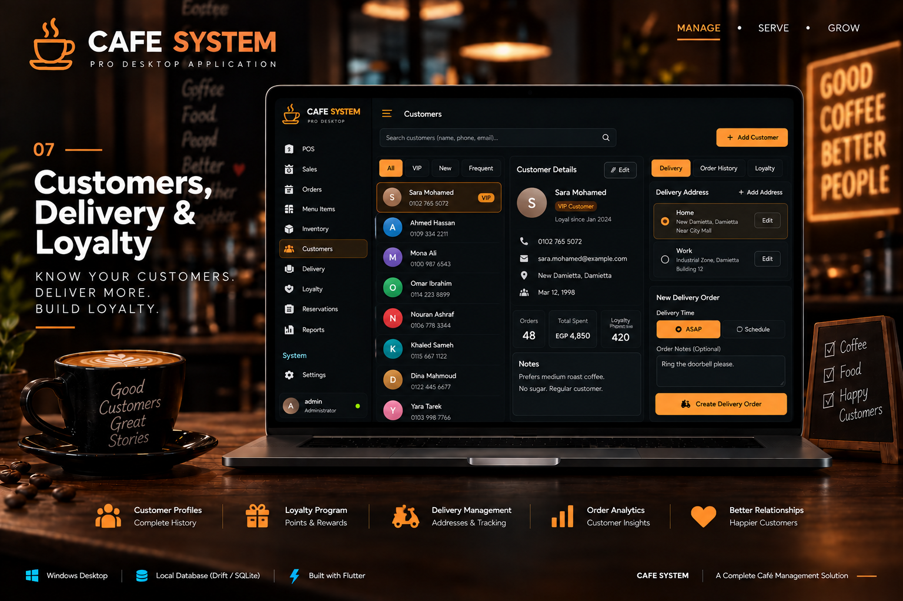

Customer records, address-book data, delivery context, requested fulfillment time, and loyalty movements exist in the implementation.

The newer customer/delivery/loyalty layer is deeper in the domain/API than in the currently integrated cashier UX, so this image is a target presentation rather than a current production screen.

---

## 08 — Payment & Receipt

> **Concept visual — not an actual screenshot**

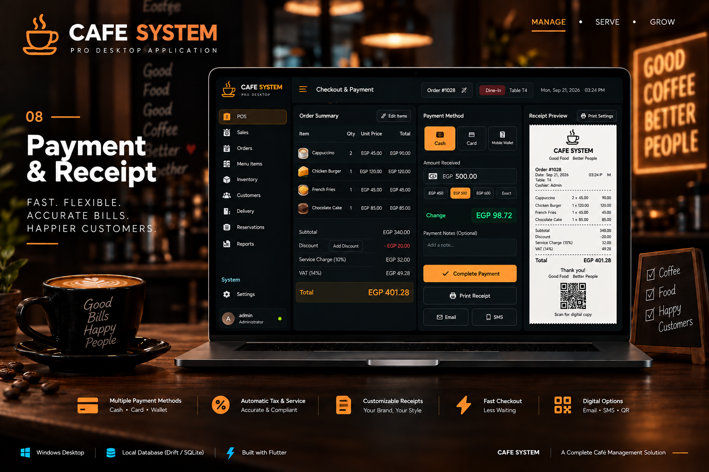

The current reachable checkout path is cash-oriented, while newer payment models support richer tender records and settlement logic.

**Important:** the visual may show card/mobile-wallet/digital options for presentation. This case study does **not** claim an integrated online payment gateway, SMS/email receipt delivery, or production digital-receipt service.

---

## 09 — Course Hold / Fire

> **Concept visual — not an actual screenshot**

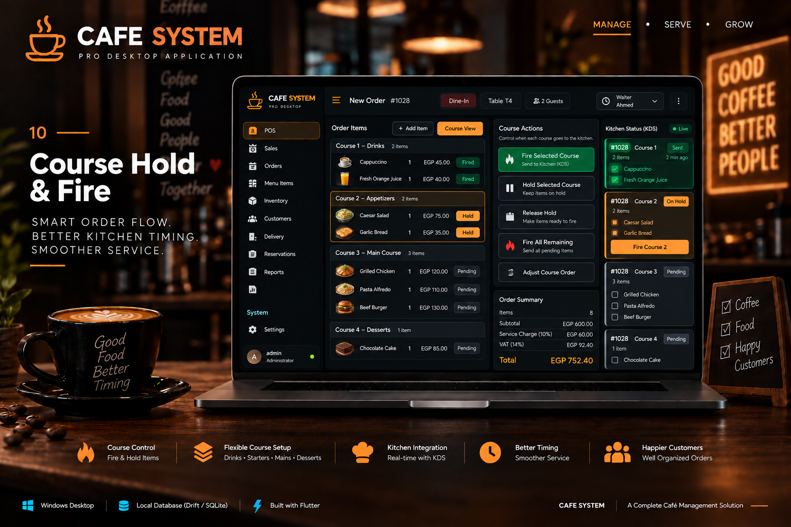

Held/fired preparation is one of the strongest domain workflows in the project. A course can remain held, later be fired, create preparation work, and participate in inventory depletion rules without repeated fire actions consuming stock repeatedly.

---

# Operating Model

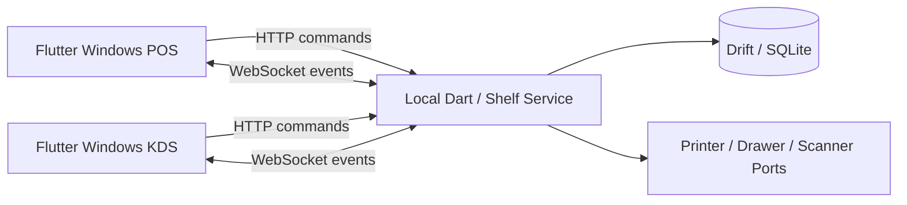

The clients do **not** independently open and synchronize SQLite database copies. The local service owns authoritative venue state.

---

# Repository Architecture

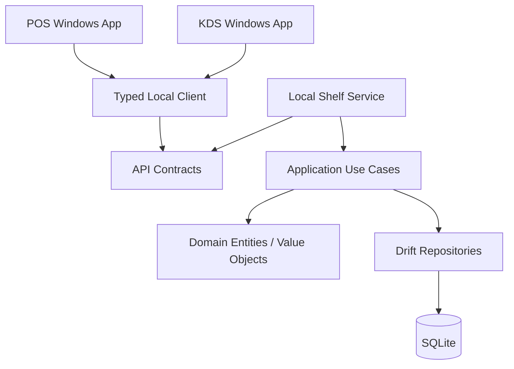

The architecture uses manual constructor injection and explicit repository / hardware ports.

---

# Core Workflow — Order to Kitchen to Stock

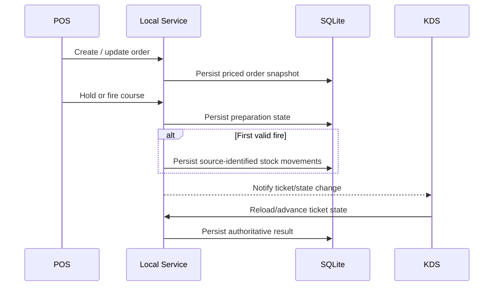

A key invariant is that repeated or replayed preparation actions must not consume the same recipe stock more than intended.

---

# Commercial Data Modeling

## Money

Normal money values use integer currency minor units.

## Inventory Cost Precision

Ingredient costing needs finer precision than normal currency because recipes can consume small fractions of purchased stock.

## Snapshots

Operational history preserves selected prices, modifiers, ticket items, receipt/tender data, and delivery snapshots so later menu/customer edits do not rewrite historical commercial facts.

---

# Dining & Preparation

The repository models:

- dining areas and tables
- reservations
- multiple checks
- table/check moves and merges
- preparation rounds
- held lines
- fired quantities
- kitchen tickets
- preparation states

---

# Inventory Coordination

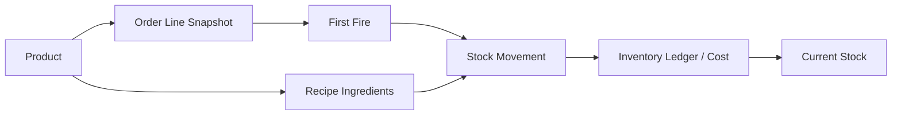

Source identities, transactions, constraints, and recovery tests support the model.

---

# Customer, Delivery & Loyalty

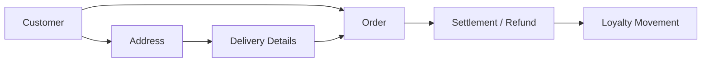

The domain/API supports this model, while some newer loyalty/payment behavior remains ahead of the main integrated POS checkout UX.

---

# Reconnect & Recovery

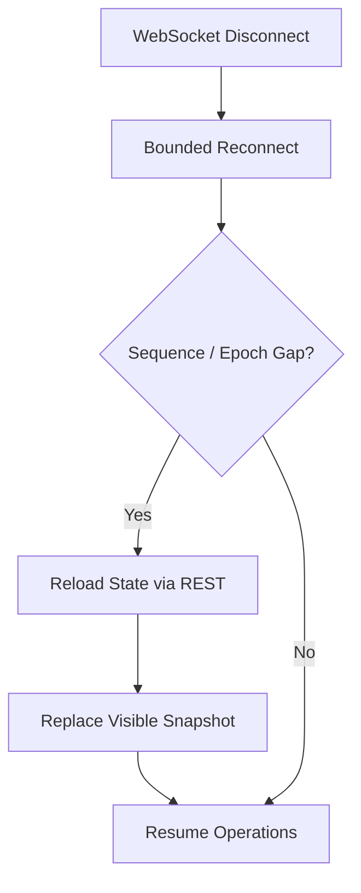

Committed data is recovered from the host database after restart. There is no claim of independent offline selling on disconnected clients or automatic host failover.

---

# Technology Stack

| Area | Technology / Approach |
|---|---|
| Cashier client | Flutter Windows |
| Kitchen client | Flutter Windows |
| Language | Dart |
| Local service | Shelf / Shelf Router |
| Realtime notifications | WebSockets |
| Persistence | Drift / SQLite |
| Client/server contract | Handwritten JSON DTOs |
| Dependency injection | Manual constructor injection |
| State | Lightweight Flutter state, ChangeNotifier, streams, local screen state |
| Localization | Arabic / English support |
| Testing | Domain, widget, API, SQLite, migration, restart / recovery checks |

---

# Verified Repository Evidence

**Audit date: 2026-09-19**

| Metric | Evidence-backed value |
|---|---:|
| Windows workstation applications | **2** — POS + KDS |
| Shared Dart packages | **6** |
| Registered Drift tables | **48** |
| Drift schema version | **10** |
| Tracked test files | **124** |
| Selected audit cases executed initially | **653** |
| Initial selected passes | **651** |
| Initial selected failures | **2** |
| Isolated reruns of those failures | **Passed once each** |
| Implemented account roles | **3** |
| Principal registered HTTP routes | **100** |
| WebSocket aliases | **2** |

> [!WARNING]
> **Do not convert this into “653 passing tests.”**  
> The selected run had 651 initial passes and 2 initial failures. Both failed cases passed in isolated reruns, which is evidence of instability rather than proof that the full suite is clean.

---

# Testing & Reliability

The repository includes automated coverage across:

- pure domain rules
- real SQLite relationships
- migration stages
- file reopen persistence
- HTTP APIs
- WebSocket recovery behavior
- order/preparation invariants
- inventory depletion and costing
- payment/loyalty operations
- selected Flutter widget flows

This is meaningful development evidence, not production certification.

---

# Security & Release Boundaries

Useful primitives exist, including password/PIN hashing, selected manager approval checks, session/device concepts, audit events, foreign keys, and version/conflict mechanisms.

The audit also found incomplete end-to-end authorization and transport integration. These remain release blockers, so this repository deliberately avoids claims such as “secure production deployment” or “fully enforced RBAC.”

---

# Current Status

**Development Implementation · Incomplete UI Integration · Security / Release Hardening In Progress**

Implemented depth includes:

- local host authority
- POS and KDS workstation boundaries
- menu variants/modifiers/combos
- dining/reservation workflows
- course hold/fire
- preparation and kitchen state
- recipe-driven inventory
- payments/receipts foundations
- customers/delivery/loyalty foundations
- migrations and restart/recovery tests

Remaining work includes:

- integrate newer payment and loyalty workflows consistently into the cashier UX
- close authorization and concurrency gaps
- stabilize full-suite verification
- finish operator-facing backup/release workflows
- validate packaging and actual café hardware

---

# What This Case Study Does Not Claim

This repository does **not** claim:

- a verified production deployment
- paying customers
- measured revenue
- measured time savings
- measured waste reduction
- measured throughput or uptime
- production-ready security
- an integrated online card-payment processor
- offline independent POS selling with later merge
- host failover
- complete hardware validation
- a fully green full test suite
- that the concept visuals are current screenshots

---

# Source & Privacy Notice

The private implementation should remain private unless publication rights are explicitly confirmed.

Do not publish credentials, tokens, password/PIN hashes, private keys, live databases, WAL/SHM files, real customer data, raw backups, private audit/security logs, or proprietary source code without permission.

---

## CAFE SYS

**Local POS · Kitchen Coordination · Inventory · Venue Operations**

**Flutter Windows + Dart/Shelf + Drift/SQLite**

